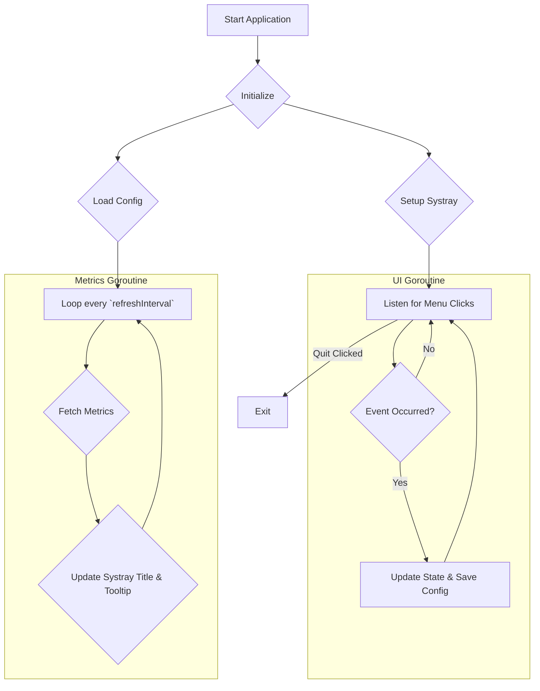

# CPU Monitor

A cross-platform system monitor for your menu bar/system tray, built with Go.

## Features

-   **Real-Time System Metrics:** Displays CPU, RAM, Disk I/O, and Network I/O in your system tray.
-   **Dynamic Tooltips:** Hover over the tray icon to see a detailed breakdown of the current metrics.
-   **Customizable Display:** Use the tray menu to switch between different monitoring modes.
-   **Configurable Refresh Rate:** Adjust how often the metrics are updated (1, 2, or 5 seconds).
-   **Cross-Platform:** Works on both macOS and Windows.
-   **Persistent Configuration:** Your settings are saved and automatically reloaded on startup.

## Getting Started

This guide is for developers who wish to build the application from the source code. For end-users, we recommend downloading the pre-compiled binaries from the [GitHub Releases](https://github.com/your-username/your-repo/releases) page (coming soon).

### 1. Prerequisites

You will need the following software installed to build the application:

-   [Go](https://golang.org/dl/) (version 1.18 or later).
-   A C compiler (required by the `systray` library).
    -   **macOS**: Install Xcode Command Line Tools: `xcode-select --install`
    -   **Windows**: Install a GCC toolchain like [TDM-GCC](https://jmeubank.github.io/tdm-gcc/) or via [MSYS2](https://www.msys2.org/).

### 2. Build the Application

We have provided simple scripts to build the application. These scripts will compile the source code and place the final executable in a `dist` directory.

-   **On Windows:**
    -   Navigate to the `scripts` directory and double-click `build.bat`.

-   **On macOS / Linux:**
    -   Open a terminal, navigate to the `scripts` directory, and run: `sh build.sh`

After the build is complete, you will find the executable in the `dist` directory.

### 3. Run the Application

Once you have built the application, you can run it directly from the `dist` directory:

-   **On Windows:** Double-click `dist\cpu-monitor.exe`.
-   **On macOS:** Double-click `dist/CPU Monitor.app`.

The application will start in the background and the icon will appear in your system tray or menu bar.

## How It Works

The application runs two main concurrent processes (goroutines):

1.  **UI and Menu Handling**: This process sets up the system tray icon and menus. It then enters a loop to listen for user interactions, such as clicking a menu item. When an event occurs (e.g., changing the display mode or refresh rate), it updates the application's configuration and saves it to `config.json`.
2.  **Metric Collection**: This process runs in a separate loop, periodically fetching system metrics (CPU, RAM, Disk, Network). After collecting the data, it updates the system tray title and tooltip based on the user's selected display mode.

This concurrent design ensures that the UI remains responsive to user input while the metrics are being collected in the background.

Here is a simplified flowchart of the application's logic:

## Configuration

The application's configuration is stored in `config.json`. On the first run, a default configuration file will be created in the appropriate user config directory:

-   **Windows:** `%APPDATA%\CPU-Monitor\config.json`
-   **macOS:** `~/Library/Application Support/CPU-Monitor\config.json`

You can customize the following settings:

-   `refresh_interval_seconds`: How often the stats are updated (in seconds).
-   `default_display`: The metric to show on startup (`cpu_ram`, `disk`, or `network`).
-   `disk_device`: The disk to monitor (e.g., "sda" on Linux, "C:" on Windows). Leave empty to monitor all disks.
-   `network_interface`: The network interface to monitor. Leave empty to use the first available interface.